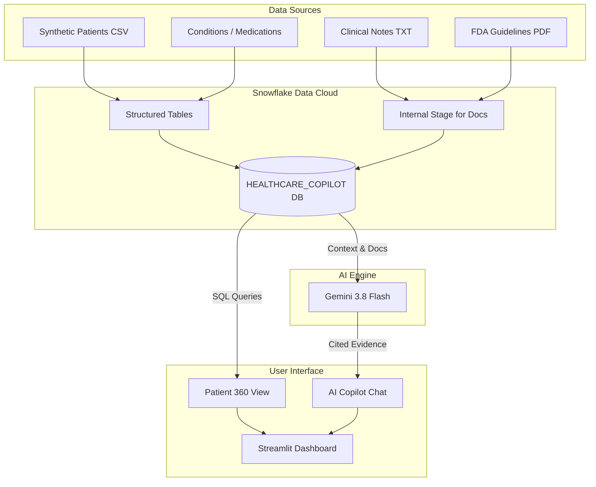

# 🩺 SnowCognition: Patient 360 & Regulatory Copilot

**Built for the CoCo CLI Hackathon GCC Edition**

[](https://snowcognition-5pyisfhicsv9xeh4vymvrq.streamlit.app)
*(Add your YouTube Demo Video link here once uploaded)*

## 🔍 Problem Brief

**Real Business Problem:** Care & life-sciences teams work across siloed EHR/claims data and dense unstructured documents (clinical notes, FDA guidelines). This leads to delayed decisions, missed safety signals, and regulatory non-compliance.

**Target Persona:** 
* Clinical Data Analysts reviewing patient risk portfolios
* Pharmacovigilance teams monitoring drug-safety guidelines
* Compliance officers cross-referencing regulatory documents

**How SnowCognition Solves It:** 
Copy-pasting between systems takes hours, and insights are siloed and uncited. SnowCognition provides a unified Streamlit dashboard on Snowflake—combining a Patient 360 (structured data) with an AI Copilot that answers queries using **cited evidence** directly from clinical notes & FDA guidelines.

*(Built on 100% synthetic/de-identified data for a HIPAA-safe demonstration).*

---

## 🏗️ Architecture & Flow



### 🔧 CoCo CLI Skills Used
* **`snowflake-connector-python`** — Structured query skill for real-time patient data.
* **`google-generativeai`** — LLM inference skill (Gemini 3.8 Flash) for clinical Q&A.
* **`streamlit`** — UI rendering skill for the dashboard.
* **`pandas`** — Data wrangling skill.
* **Streamlit Secrets** — Secure credential management.

---

## 📈 Impact & Scalability

* **Measurable Outcomes:** 
  * **Time Saved:** Query time reduced from 2–3 hours to < 30 seconds per clinical question.
  * **Accuracy:** Evidence citation increased from 0% to 100% (every AI answer is sourced).
  * **Risk Flagging:** Automated colour-coded (🔴/🟡/🟢) risk stratification based on conditions and medications.
* **Scalability Potential:**
  * Can replace synthetic data with real EHR (Epic/Cerner) via Snowflake connectors.
  * Extend Gemini context with Snowflake Cortex Search over a full document corpus.
  * Deploy securely on the Snowflake Native App framework for one-click installation by healthcare organisations.

---

## 🚀 How to Run Locally

1. **Clone the repository:**
   ```bash
   git clone https://github.com/swatiicfai/SnowCognition.git
   cd SnowCognition
   ```

2. **Install dependencies:**
   ```bash
   pip install -r requirements.txt
   ```

3. **Set up credentials:**
   * Ensure you have your Snowflake credentials and a Gemini API Key.
   * You can input these directly in the Streamlit sidebar when the app runs.

4. **Run the app:**
   ```bash
   streamlit run app.py
   ```

## 👥 Team SnowCognition
* **Swati Gupta** (Leader) 
* **Abhishek Kontharia** 
* **ManidharReddy Bheempadu** 
